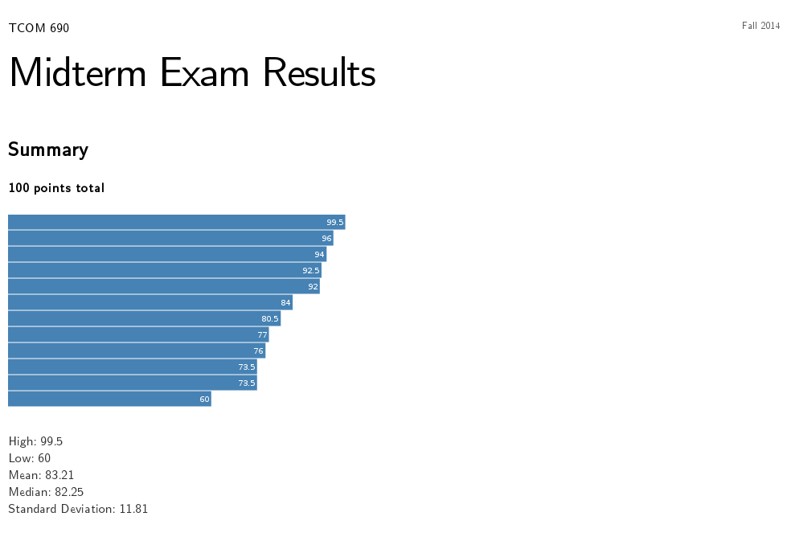
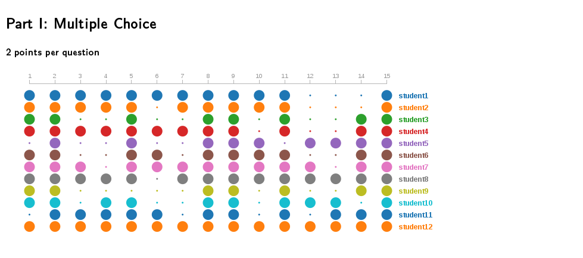
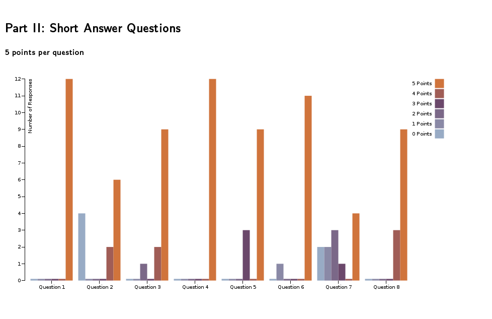
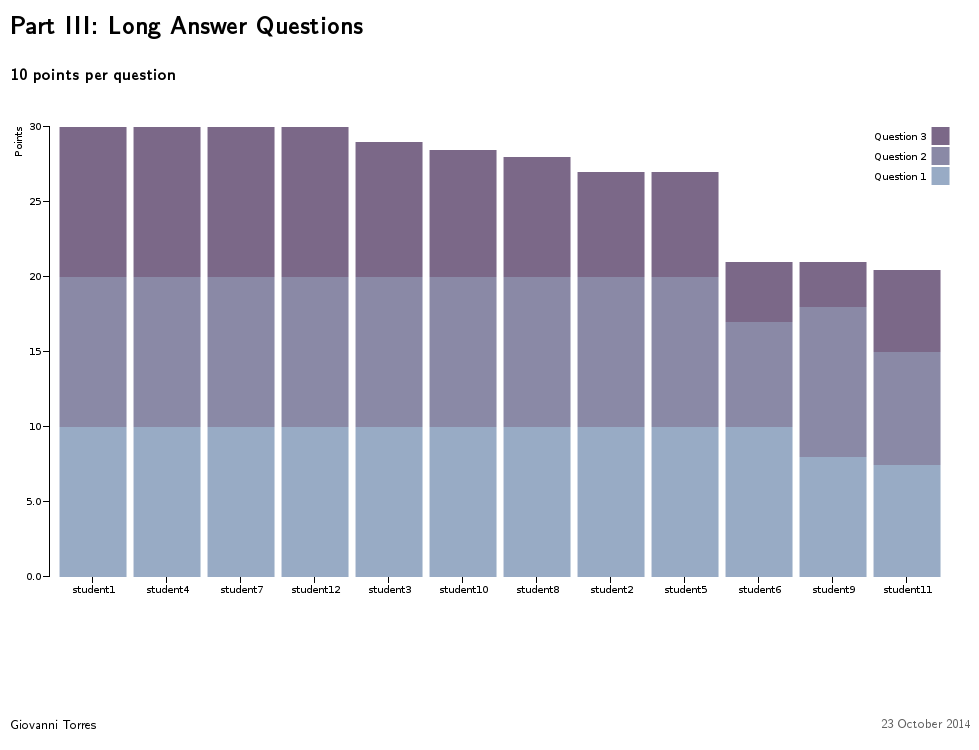

Midterm Viz
===========

Midterm Viz is a set of D3 graphs created to visualize academic test results such as midterms or final exams.  

It contains four sections:

- Summary
- Multiple Choice questions
- Short Answer questions
- Long Answer questions

Summary Section
---------------

The summary section is a horizontal bar graph that shows the overall exam grades.

The grades for this section are stored in *grades/summary_grades.csv*.

Multiple Choice
---------------

The multiple choice section uses a big and a small circle to represent correct and incorrect responses respectively.  With this graph, it is easy to see which questions were too easy or too hard.

The answers for this section are stored in *grades/part1_grades.json*.

Short Answer Questions
----------------------

The short answer section uses a grouped bar chart.  Each group represents a the total number of responses for each question.  There are six bars in each group, each representing the number of responses by points.  Each question in this section is worth 5 points.

The answers for this section are stored in *grades/part2_grades.csv*.

Long Answer Questions
---------------------

The long answer section uses a stacked bar chart.  Each bar shows the total number of points per student for this section.  Each of the three questions in this section are stacked to provide the total.

The answers for this section are stored in *grades/part3_grades.csv*.

Instructions
============

First, clone the project:

    git clone https://github.com/giovtorres/midterm-viz.git

Then, edit *grades.html* to match your exam structure.  You will probably have to add, remove and or expand sections.

Next, you will need to substitute grades for each section.  You may have to adjust some widths if the graphs become too wide.

Inspiration
===========

The *grades.html* page and graphs were inspired by the following [D3 examples](https://github.com/mbostock/d3/wiki/Gallery):

- http://bl.ocks.org/mbostock/3887051
- http://bl.ocks.org/mbostock/3886208
- http://neuralengr.com/asifr/journals/

